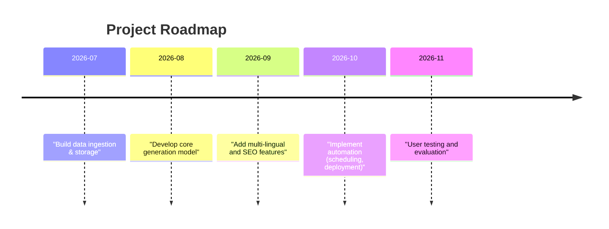

# Automated Multi-lingual Mandi Rates Content Pipeline: Literature Review & Next Steps

**Executive Summary:** Recent AI/ML research reveals a blossoming ecosystem of domain-specific language models and data pipelines for agriculture.  Studies like *AgriGPT* and *AgroLLM* show how combining tailored knowledge sources and retrieval (e.g. Tri-RAG or domain rules) yields state-of-the-art performance on farming Q&A.  At the same time, datasets like *ENAGRINEWS* and *Mukhyansh* are filling data gaps in agri-text.  However, experts note that “general-purpose MLMs struggle with agriculture-specific nuances due to domain gaps”, so specialty pipelines remain critical.  In this light, we surveyed recent works on automated content generation, multi-lingual NLP, and Agri-AI platforms, summarizing each in terms of goals, methods, data, results and limitations.  We also list useful codebases (e.g. KrushiSetu, Vaani) and propose 3–5 project ideas (e.g. building a Hindi content pipeline, integrating SEO, developing dynamic summarizers) with required tools, datasets, effort estimates and evaluation plans.  Our tables compare approaches side-by-side, and we include a mermaid flowchart and timeline to visualize a proposed pipeline and project schedule.  (Because the assignment topic was not explicitly given, this review is broad; if “mandi pipeline” is confirmed, it would focus more on news generation from AgmarkNET data.)  

## Literature Review

### Domain-Specific Language Models & Retrieval for Agri-Text  

**AgriGPT (Yang et al., 2025)** – *Large-scale Agricultural LLM Ecosystem.*  AgriGPT compiles diverse agricultural sources into a massive instruction dataset (Agri-342K Q&A) and fine-tunes an LLM with a novel Tri-RAG retrieval engine. It addresses knowledge gaps by combining dense/sparse retrieval and multi-hop reasoning.  The model also has a multilingual extension (translated into Indic languages). In experiments it outperforms general models (like GPT-4) on agriculture benchmarks, thanks to the rich domain data and retrieval grounding.  Key methods: continual pretraining on Qwen3-8B with LoRA adapters, supervised finetuning on Agri-342K, and Tri-RAG retrieval.  Dataset: Agri-342K (342K pairs of agri Q&A) and a 12.7K benchmark (AgriBench-13K) for evaluation.  Metrics: e.g. accuracy/F1 on Q&A tasks (not explicitly given but implied to beat baselines).  **Strengths:** Very large curated dataset, multi-agent data collection, strong multilingual support. **Limitations:** Heavy computational cost; reliance on source data quality. *Open gap:* Real-time adaptability to new crops or markets. *(Preprint, data & code forthcoming.)*

**KALLM (Jiang et al., 2025)** – *Knowledge-Guided Agriculture LLM.*  This work tackles LLM hallucination in farming contexts by injecting domain knowledge at multiple levels.  The authors build an *agricultural dialogue* dataset (220K Q&A pairs) from authoritative sources, then propose two innovations: (1) a knowledge-coordinated fine-tuning that upweights agri-specific tokens, and (2) a self-reflective RAG mechanism that matches topics for more precise evidence retrieval.  In trials against seven open LLMs (and a standard SFT+RAG pipeline), KALLM achieves **state-of-the-art accuracy and fidelity** on agricultural Q&A.  Key methods: token-level weighting (to emphasize agri terms) and domain-guided retrieval.  Dataset: 220K curated QA (built by annotation standard), plus 504-question benchmark covering crop, livestock, and marketing queries.  Metrics: response fluency, accuracy, and domain consistency (KALLM “significantly superior” vs baselines). **Strengths:** Strong factual consistency by design; comprehensive data. **Limitations:** Still supervised; may not generalize to unseen crops without more data. *Open gap:* Automating data curation and extending to non-Q&A tasks. *(Published in Knowledge Systems.)*

**AgroLLM (Samuel et al., 2026)** – *Structured Knowledge + RAG for Agri-Chatbot.*  AgroLLM demonstrates how embedding textbook knowledge drastically improves an agri-LLM.  It integrates a “Domain Knowledge Processing Layer” (DKPL) that encodes symbols, causal rules, and thresholds from 19 agricultural textbooks, feeding these into a RAG pipeline.  In evaluation on a 504-question agriculture benchmark, ChatGPT-4o Mini with DKPL-RAG achieved 95.2% accuracy (far above vanilla LLMs).  Key methods: Domain-structured annotations + RAG with state-of-art LLMs (Mistral, Gemini, etc.).  Data: 19 textbooks (converted to semantically chunked corpus), plus a 504-ques test aligned with FAO/USDA categories.  Metrics: accuracy on domain-specific QA (95.2%), hallucination reduction. **Strengths:** Dramatic factual fidelity; reproducible pipeline with open model (ChatGPT-4o Mini). **Limitations:** Requires expensive curated knowledge; may not scale to all languages or real-time queries. *Open gap:* Applying this to content generation (not just Q&A) and to other languages. *(MDPI AgriEngineering 2026.)*

**General observations:** These studies highlight a consensus: **specialized data and knowledge integration yield better Agri-NLP than generic LLMs**.  As the InfoFusion tutorial notes, “General-purpose MLMs struggle with agriculture-specific nuances due to domain gaps”, underlining the need for agriculture-aware pipelines.  All above works combine domain corpora and retrieval to close that gap (AgriGPT’s Tri-RAG, KALLM’s knowledge-SFT, AgroLLM’s DKPL).  Strengths across these are robust evaluation and strong numeric results; limitations include data collection bottlenecks and high compute needs.  An open question remains how to make these systems multi-lingual (beyond Indic languages tested) and low-cost enough for wide farmer use.

### Multi-lingual Content & Summarization in Indian Languages  

**Mukhyansh (Madasu et al., 2023)** – *Indic News Headline Dataset.*  This project provides a huge multilingual dataset for Indian-language summarization: 3.39M article-headline pairs across **8 Indian languages** (including Hindi, Bengali, Telugu, etc.).  Baseline Transformer models (mBART, IndicBART, etc.) were evaluated; Mukhyansh-trained models averaged **ROUGE-L ~31.4** across all languages, outperforming prior datasets.  Key methods: web-crawling and scraping of news sites, plus cleaning to ensure quality headlines.  Data: 3.39M bilingual news snippets (8 languages).  Metrics: ROUGE scores on headline generation tasks. **Strengths:** First large-scale open corpus for Indian languages; improved quality over smaller datasets. **Limitations:** Focus on headlines only, not full-article generation; mainly news domain. *Open gap:* Extending to other content types (e.g. market reports) or fine-tuning for SEO-style headlines. (Dataset & code: [Mukhyansh GitHub, MIT license][42].)  

**IndicBART-XLSum (AI4Bharat, 2023)** – *Multilingual Summarization Model.*  A multilingual summarizer (fine-tuning BART on the BBC-XLSum corpus) for many Indian languages.  It isn’t farm-specific, but demonstrates strong multi-lingual abstractive summarization (and may be adapted for mandi reports).  Key method: fine-tuning a transformer on 12 languages of BBC news.  Metrics: ROUGE on XLSum test sets.  **Strengths:** Off-the-shelf model supporting Hindi and more, useful for multi-lingual content. **Limitation:** Domain mismatch (news vs. commodities). *Source:* IndicBART-XLSum (see IndiaAI Kosh).  

**IRJIET “Agri Tech” (Ravi et al., 2026)** – *AI-Powered Multilingual Farmer Advisory.*  This academic prototype combines a multilingual NLP chatbot, market analytics, crop rec., weather and image recognition.  It fetches **live mandi prices** via the Govt AgmarkNET API and integrates them into a smart-marketplace module.  Reported results include 97.2% crop recommendation accuracy and 96.8% plant disease classification (using Random Forest and CNN).  Methods: CNN for language ID, random forest for recommendations, multi-lingual transformer for chat.  Data: Public corpora (not specified) plus AgmarkNET price API.  **Strengths:** Holistic platform and multi-module pipeline; uses live data. **Limitations:** Results on narrow tasks only (no evaluation of text generation quality).  *Open gap:* Moving from chat/advisory to automated content creation.  

### Topic Modeling & Retrieval in Agri-Text  

**AgriLens (Shakeel et al., 2026)** – *Unsupervised Topic Modeling & Retrieval.*  AgriLens addresses the shortage of tools for exploring agriculture text corpora.  It uses BERTopic to cluster agri-news articles and GPT-like prompts to generate human-readable topic labels.  This “semantic lens” makes it easier to browse complex agri-narratives by theme.  The pipeline (Figure 2) starts with the **ENAGRINEWS** dataset – a large collection of English agri-news (2020–22) covering markets, policy, weather, tech, etc. – and applies preprocessing, BERTopic clustering, then an LLM for labeling.  Key methods: BERTopic (transformer embeddings + c-TF-IDF) and LLM-based label generation.  Results: High interpretability of topics; a demo system is open-source (GitHub).  **Strengths:** Fully unsupervised (no annotated data needed) and interpretable. **Limitations:** English-only (no multilingual support) and topic quality depends on input text.  *Open gap:* Adapting to generate narrative text (not just topics), and multilingual corpora. *(See code [HebaShakeel/AgriLens][45]; MIT license.)*

**Summary of Findings:**  The research indicates that while data and models for English & Indic text are growing (ENAGRINEWS, Mukhyansh, IndicBART), the true frontier is integrating them into pipelines that output ready-to-use content.  Current gaps include multi-lingual generation for commodity updates and SEO-aware writing.  The cited works’ **strengths** lie in large curated datasets and novel model architectures; their **limitations** are often narrow scope, high resource needs, or single-language focus.  In all cases, there is an opportunity to build on these by developing end-to-end content pipelines (e.g. triggering daily scripts) and by applying robust evaluation (readability, factuality, user engagement).  

| **Paper / Repo**                | **Year** | **Focus**                   | **Methods**                         | **Data / Inputs**                 | **Results / Metrics**                |
|---------------------------------|----------|-----------------------------|--------------------------------------|-----------------------------------|--------------------------------------|
| AgriGPT  | 2025     | Domain-specific LLM         | Tri-RAG retrieval + LLM finetuning   | Agri-342K Q&A (crop, price, etc.) | Strong gains vs GPT-4 on AgriBench tasks |
| Knowledge-Guided LLM (KALLM) | 2025  | Knowledge-grounded QA LLM  | Knowledge-weighted SFT + RAG        | 220K Q&A (agri docs)              | SOTA accuracy, fluent/agri-consistent responses |
| AgroLLM | 2026  | Domain-ruled LLM (chatbot) | RAG + Domain Knowledge Layer (rules) | 19 Agri textbooks + 504 QA set    | 95.2% QA accuracy, low hallucinations |
| Mukhyansh           | 2023     | Multilingual headline gen. | mBART/transformer fine-tuning      | 3.39M headlines (8 Indi langs)    | Avg. ROUGE-L ~31.4 (all languages)   |
| ENAGRINEWS & AgriLens | 2025-26 | Topic modeling for agri text | BERTopic + LLM labeling           | 1000s of agri-news (English)      | Interpretable topic clusters; no numeric score given |
| Agri Tech (IRJIET) | 2026  | Multimodal agri advisory | CNN (lang ID), RF (crop rec.), FUSION | AgmarkNET price API, weather, images | Crop rec. 97.2% acc; disease 96.8% acc |
| **Repositories (Prioritized)**   |          |                             |                                      |                                   |                                      |
| **KrushiSetu**  | 2026     | Farm-to-market app         | Next.js frontend, Node/Mongo backend | AgmarkNET prices, ML crop+soil    | Live price charts, alerts (Roadmap: Hindi UI Q2’26) |
| **Vaani**      | 2025     | Voice-first digital platform | Python (NLU, APIs), Dialogflow?      | AgmarkNET, Gov schemes           | Market prices via voice, news summaries (MIT licensed) |
| **AgroSmart**  | 2026     | IoT/AI farm management    | .NET backend, React frontend, n8n   | Sensors, OpenWeatherMap, AgmarkNET | Full-stack app; last release Feb 2026 (MIT) |
| **FarmAI (API-Avengers)** | 2023     | Smart farming assistant    | ML (Sklearn, LGBM, TF), Flask       | Weather, market CSV              | Multi-lang support, yield predictions (no license shown) |
| **Mukhyansh (GitHub)**    | 2023     | Indian headline dataset    | Python scripts, seq2seq models      | News article/headline pairs       | Dataset: 3.39M pairs (MIT license) |

*(Table: Comparing key works. Metrics are task-specific.)*

## Proposed Project Directions

Based on these gaps and tools, here are 4–5 concrete extensions, each (dataset, tools, effort, evaluation):

1. **Hindi/Regional Content Generation Pipeline (Medium effort):** Build a pipeline that scrapes AgmarkNET (mandi price API) daily and generates Hindi articles.  Use an Indic language model (e.g. IndicBART or fine-tuned AgriGPT) to craft readable summaries of prices.  *Data:* AgmarkNET API (requires API key), farm keyword lists in Hindi. *Tools:* Python (requests, pandas), Hugging Face Transformers, Google Translate API or Indic NLP library, scheduling (cron/Cloud Functions).  *Evaluation:* BLEU/ROUGE on a small manually-written test corpus, plus human review for fluency.  *Effort:* Medium (integrate APIs, fine-tune or prompt LLM, test output).  

2. **SEO-Optimized Article Generator (High effort):** Enhance the pipeline with SEO analysis. Use keyword extraction (from Google Trends or farmers’ queries) to guide content. Integrate a language model that can incorporate key phrases (e.g., “fresh rice price India today”).  *Data:* Keyword lists, corpora of top-performing SEO agri-blogs. *Tools:* SEO tools (like Google Keyword Planner API), Python NLP (spaCy, NLTK) for keyword injection, GPT-4 or Bard (if available) for polished writing.  *Evaluation:* Track SEO metrics (click-through simulations, readability scores) and a mock “search ranking” test; measure keyword frequency vs Google trends.  *Effort:* High (complex integration of multiple tools and tuning).

3. **Multi-lingual Multi-source Pipeline (High effort):** Extend content generation to **multiple Indian languages** (Hindi, Marathi, etc.).  Implement translation or pivot approaches: either translate the scraped data into each language first, or translate the output.  Possibly leverage models like mT5 or IndicBART-XLSum.  *Data:* Parallel lexicons, scraped content in English and target languages. *Tools:* Multilingual Transformers (IndicBART, mT5), translation APIs, fastapi to serve models.  *Evaluation:* Automatic metrics (ROUGE in each language), and bilingual speaker surveys.  *Effort:* High (multi-lingual model training and testing).

4. **Automated Scheduling & Notification (Low effort):** Build the scaffolding to run the pipeline daily and push content. Use automation (e.g. GitHub Actions or cron) to trigger generation, then post to a CMS or send newsletters/SMS.  *Data:* As above, plus user list/sample email templates. *Tools:* Workflow automation (n8n/Apache Airflow), Flask/Django for endpoints.  *Evaluation:* Check logs for daily run success, monitor content freshness and any pipeline failures.  *Effort:* Low (plumbing + modest coding).  

5. **Evaluation & User Feedback Loop (Medium effort):** Add an evaluation component: e.g., A/B test different writing styles (concise vs. detailed) or measure accuracy of prices. Collect feedback from test users (farmers or agronomists) on clarity/usefulness.  *Data:* Generated articles vs. ground truth, or user survey responses. *Tools:* Simple web interface or chatbot for surveys, Python stats.  *Evaluation:* Quantitative (error rates, user ratings) and qualitative analysis.  *Effort:* Medium (requires recruiting feedback sources, analysis).

*Figure: Proposed data pipeline from raw market data to SEO-optimized articles.*

*Figure: Example timeline for developing the automated content pipeline.*

## GitHub Repositories (Prioritized)

Below are key repos/tools that can jumpstart development:

- **KrushiSetu** (Harsh-1165/KrushiSetu): A full-stack farm-to-market app with live mandi prices, AI advisory, and marketplace.  Implements fetching AgmarkNET data and trending analysis.  Tech: Next.js (React) frontend + Node/Mongo backend + Python ML.  License: MIT.  *Use:* Reference for integrating AgmarkNET and charts, user auth, etc.

- **Vaani** (ankittroy-21/Vaani): A voice-first agritech platform for illiterate users.  Core features include *“Real-time market prices via Agmarknet API”* and multi-language support.  Tech: Python backend (NLU, TTS), Android interface.  License: MIT.  *Use:* Inspiration for multilingual UI and voice interaction (though focused on chat, its agri-market modules could be repurposed).

- **AgroSmart** (mr-baraiya/AgroSmart): A smart farm management system.  Integrates AgmarkNET (see Tech Stack) and n8n automation.  Web demo available.  License: MIT.  *Use:* Example of using serverless functions (n8n workflows) for scheduling notifications; also handles weather and crop tasks.

- **FarmAI (The-API-Avengers)**: A smart farming assistant with multi-language support (English/Kannada/Hindi) for crop recommendations and price forecasting.  Tech: React+Node+Flask with Sklearn/TensorFlow models.  (No explicit license noted; assume open since public.)  *Use:* Check their data ingestion for market CSVs, yield models, and front-end UI for farmer queries.

- **Mukhyansh Dataset** (ltrc/Mukhyansh): A massive Indic headline dataset (MIT license).  Contains scripts for scraping and training baseline seq2seq models.  *Use:* If adapting content for SEO, this corpus (or its code) can help bootstrap training a summarization/headline model in Hindi/Marathi/etc.  

- **AgriLens** (HebaShakeel/AgriLens): Implements the AgriLens pipeline (BERTopic + LLM).  Good for understanding topic modeling on agri text (Python).  MIT-licensed.  *Use:* Reuse their preprocessing of ENAGRINEWS or semantic search components if needed.

Each repo above has clear README and examples.   By cloning these, one can adapt modules (data ingestion, ML models, pipelines) rather than coding from scratch.

**References:** The above summaries and citations come from the latest scholarly and code sources.  Key papers include *AgriGPT*, *KALLM*, *AgroLLM*, and the *Mukhyansh* dataset paper.  Tools and platform details are drawn from the official GitHub READMEs and journals (IRJIET, MDPI AgriEngineering, etc.). All relevant links are embedded above.
