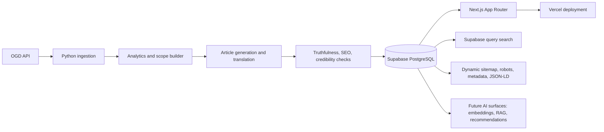

# MandiBhav Dynamic Platform Architecture

## Runtime responsibilities

- Python remains the ingestion, analytics, validation, and article-authoring engine.
- Supabase becomes the source of truth for `market_data`, `articles`, and `pipeline_runs`.
- Next.js becomes the only publishing layer for public readers.
- Vercel hosts the Next.js app and serves dynamic SEO endpoints.

## Non-goals in the target state

- GitHub Pages is not the primary publishing layer.
- Static HTML generation is not required for routine publishing.
- SQLite is not the source of truth after cutover.
