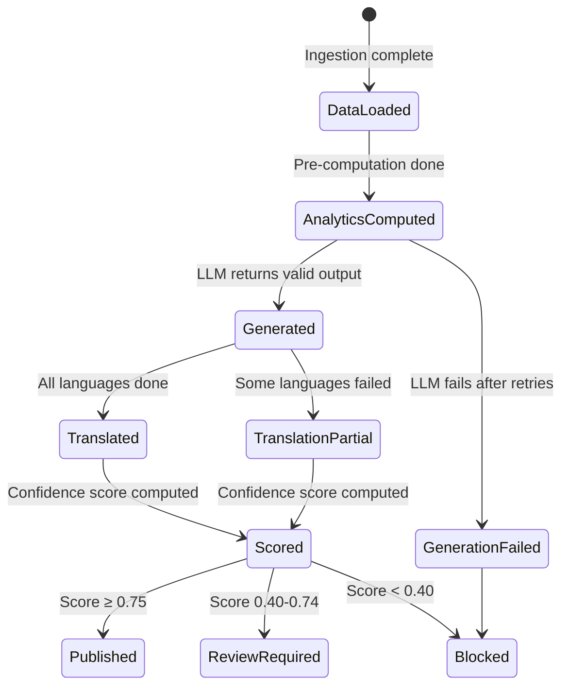

# MandiBhav by GramIQ — Design Review (DR-3)

> **Review Type**: Critical Architecture Evolution
> **Reviewing**: Revised System Architecture (v2)
> **Stance**: Assignment-winning practical execution over architectural elegance.

---

## 1. Executive Review

### What v2 Got Right

The v2 revision made the correct macro-decisions: SQLite over PostgreSQL, synchronous over async, CLI-first over FastAPI-first, Gemini-primary for translation. These choices cut implementation time roughly in half. The pre-computed analytics layer, the three-layer prompt architecture, and the Pydantic-enforced structured output remain the plan's strongest ideas — they are architecturally correct and differentiate this submission from "just call the Gemini API with raw data."

### What v2 Still Gets Wrong

1. **The system is still infrastructure-first, not content-first.** The plan spends 60% of its space on how data flows through code modules and 10% on what the articles actually look like. The evaluators will judge the **output articles**, not the database schema. The content strategy needs to be the center of gravity.

2. **Knowledge grounding is absent.** The LLM generates articles from price data alone. It has no context about what Minimum Support Price (MSP) means for soybean, what "kharif season" implies for arrivals, or why Mandsaur is the largest soybean market in Asia. Without this context, the articles will read like a weather report reciting numbers. Fixing this is free — it's just prompt engineering.

3. **The mock mode is described but not designed.** v2 says "use CSV fixtures" but doesn't define a provider abstraction. The ingestion module needs a clean interface so that swapping mock↔live is a config flag, not a code change.

4. **SEO is still 2019-era keyword stuffing.** Deterministic keyword injection is necessary but insufficient. The modern SEO playbook is entity-based, FAQ-driven, and structured around search intent. The plan needs to generate articles that answer the actual questions farmers type into Google.

5. **No editorial judgment.** Everything auto-publishes. If the LLM hallucinates a 50% price spike because of a data anomaly, it ships. A simple confidence score — even a heuristic one — would catch the worst outputs.

This DR fixes all five.

---

## 2. Content Architecture Review

### 2.1 The Core Problem

The current plan treats content as a byproduct of the pipeline. The thinking is: "we have data → we generate text → done." This produces technically correct but **editorially empty** articles. A farmer reading "Soybean modal price in Mandsaur was ₹5100 today, up 1.25% from yesterday" gets the same information from a table in half the time.

The articles need to do something a table cannot: **explain, compare, advise, and contextualize.**

### 2.2 Article Family Taxonomy

| # | Article Family | Target Audience | Search Intent | SEO Value | AI Citation Value | Generation Effort | MVP Phase |
|---|---|---|---|---|---|---|---|
| 1 | **Daily Commodity Report** | Traders, analysts, researchers | "soybean mandi bhav today" | 🟢 Very High | 🟢 High — structured daily factual summary | Low — template + data | ✅ MVP |
| 2 | **State Market Report** | Farmers in that state | "soybean bhav Maharashtra aaj" | 🟢 Very High — hyper-local | 🟢 High — regional specificity | Low — template + state filter | ✅ MVP |
| 3 | **Market Spotlight** | Local farmers/traders at that APMC | "Mandsaur mandi bhav today" | 🟢 Highest — ultra-local | 🟡 Medium — very narrow scope | Low — template + market filter | ✅ MVP |
| 4 | **Best Market Today** | Farmer deciding where to sell | "best mandi for soybean today" | 🟢 Very High — direct transactional | 🟢 High — direct Q&A format | Very Low — top-N sort | ✅ MVP |
| 5 | **Top Gainers & Losers** | Traders tracking momentum | "soybean price up today" | 🟡 Medium — volatile keywords | 🟡 Medium — trending data | Very Low — sort + delta | ✅ MVP |
| 6 | **Farmer Advisory** | Smallholder deciding sell/hold/wait | "should I sell soybean today" | 🟡 Medium — advisory intent | 🟢 High — actionable Q&A | Medium — requires contextual reasoning | ⚠️ Nice to Have |
| 7 | **Weekly Trend Analysis** | Analysts, government officials | "soybean price trend this week" | 🟡 Medium — evergreen | 🟢 High — temporal reasoning | Medium — requires 7-day data | ❌ Phase 2 |
| 8 | **Arrival Trend Report** | Supply chain, wholesalers | "soybean arrival today India" | 🟡 Medium — niche | 🟡 Medium — supply side data | Low — arrivals focus | ❌ Phase 2 |

### 2.3 Content Generation Matrix (MVP)

This matrix defines exactly which articles are generated daily and how:

```
For each commodity (soybean, cotton):
  ├── 1× Daily Commodity Report (national)
  ├── N× State Market Report (1 per state with ≥3 reporting markets)
  ├── M× Market Spotlight (top 2 markets by arrival volume)
  ├── 1× Best Market Today
  └── 1× Top Gainers & Losers
```

**Estimated daily output (MVP)**:

| Component | Soybean | Cotton | Total |
|---|---|---|---|
| Daily Commodity Report | 1 | 1 | 2 |
| State Market Report | ~5 | ~4 | ~9 |
| Market Spotlight | 2 | 2 | 4 |
| Best Market Today | 1 | 1 | 2 |
| Top Gainers & Losers | 1 | 1 | 2 |
| **English subtotal** | **10** | **9** | **19** |
| **× 4 languages** | | | **76 JSON files** |

This hits the 15-20 unique article target with room to spare. Each article type uses a different prompt template, so content diversity is guaranteed without artificial padding.

### 2.4 Prompt Template Per Article Family

Each family gets a distinct Layer 3 (dynamic user message) template. The system prompt and few-shot examples are shared.

**Daily Commodity Report**:
```
Write a national daily report for {commodity} on {date}.
Structure: Opening hook (market sentiment in one line) → National overview 
(avg price, change %) → Regional highlights (top/bottom states) → 
Arrival analysis → Outlook for tomorrow.
Tone: Authoritative agricultural journalist.
Word target: 500-700 words.
```

**State Market Report**:
```
Write a state-level report for {commodity} in {state} on {date}.
Structure: State summary → Market-by-market breakdown table → 
Comparison with national average → Local factors affecting prices.
Tone: Local reporter familiar with the region.
Word target: 400-600 words.
```

**Market Spotlight**:
```
Write a focused analysis of {market_name} market for {commodity} on {date}.
Structure: Market profile (why this market matters) → Today's prices → 
Comparison with yesterday and state average → Arrival volumes.
Tone: Market analyst writing a briefing.
Word target: 300-400 words.
```

**Best Market Today**:
```
Write a short advisory answering: "Where should a {commodity} farmer sell today?"
Structure: Top 3 markets by modal price → Price at each → Distance/region context.
Format this as a direct answer to the question. Use a ranked list.
Tone: Trusted advisor speaking directly to the farmer.
Word target: 200-300 words.
```

**Top Gainers & Losers**:
```
Write a momentum report for {commodity} on {date}.
Structure: Top 3 markets with highest price increase → Top 3 with largest 
decrease → What the movement signals.
Tone: Market commentator tracking daily swings.
Word target: 300-400 words.
```

> [!TIP]
> The **Best Market Today** and **Top Gainers & Losers** articles are the cheapest to generate (short, highly structured) but have among the highest SEO value because they directly answer transactional search queries. Prioritize these.

---

## 3. Editorial Workflow Design

### 3.1 Confidence Scoring

Every generated article gets a heuristic confidence score (0.0 – 1.0) computed **before** publishing.

| Signal | Weight | How Measured | Red Flag Example |
|---|---|---|---|
| **Data Coverage** | 0.20 | Number of reporting markets for this scope | Only 1 market reported (data too thin) |
| **Numeric Integrity** | 0.25 | All numbers from `pre_computed_analytics` appear in article body | LLM dropped the arrival figure |
| **Price Anomaly** | 0.20 | Day-over-day modal price change within ±25% | Modal price jumped 40% (likely data error or LLM hallucination) |
| **Output Validity** | 0.15 | Pydantic validation passed, word count in range, HTML parseable | Word count below 200 or above 1000 |
| **Translation QA** | 0.10 | Numeric preservation check + length ratio check (see v2 §7.3) | Translation lost 3 numbers |
| **Keyword Coverage** | 0.10 | Required keywords found in article / total required | 2 of 5 keywords missing |

**Scoring formula**: Weighted sum. Each signal scores 0.0 (fail) or 1.0 (pass). Final score = Σ(weight × signal_score).

### 3.2 Publishing Modes

| Mode | Score Range | Behavior | When to Use |
|---|---|---|---|
| **Auto Publish** | ≥ 0.75 | Write to `output/`, log as published | Normal operation. Most articles land here. |
| **Review Required** | 0.40 – 0.74 | Write to `output/review/`, log warning | Data anomaly, missing keywords, thin content. Pipeline continues. |
| **Blocked** | < 0.40 | Do NOT write to output. Log as failed with reasons. | Severe data issue, LLM failure after retries, translation catastrophically broken. |

### 3.3 State Transitions



### 3.4 MVP Implementation

For the MVP, the editorial workflow is a **single function** called after article generation:

```python
def compute_confidence(article: ArticleOutput, analytics: AnalyticsPayload) -> float:
    """Returns 0.0-1.0 confidence score. Pure function, no side effects."""
    score = 0.0
    score += 0.20 * (1.0 if analytics.market_count >= 3 else 0.0)
    score += 0.25 * check_numeric_integrity(article.body_html, analytics)
    score += 0.20 * (1.0 if abs(analytics.day_change_pct) < 25 else 0.0)
    score += 0.15 * check_output_validity(article)
    score += 0.10 * 1.0  # Translation QA (placeholder for EN-only pass)
    score += 0.10 * check_keyword_coverage(article)
    return score
```

No database state machine. No queue. Just a float that determines which output directory the file goes to.

---

## 4. Knowledge Layer Design

### 4.1 The Gap

The LLM currently receives only today's price data. It knows that soybean costs ₹5100 in Mandsaur, but it doesn't know:

- The government MSP for soybean is ₹4892 (so ₹5100 is **above** MSP — a significant farmer-facing fact)
- Mandsaur is the **largest soybean market in Asia** (contextual importance)
- June is **kharif sowing season** (arrivals are naturally low because old stock is depleted)
- Maharashtra produced 48 lakh tonnes of soybean last year (state significance)

Without this knowledge, the LLM writes generic narration. With it, the LLM writes **expert analysis**.

### 4.2 Design: Static Knowledge Files (Not RAG)

This is NOT a vector database. It's a set of JSON files loaded into prompts.

```
data/
└── knowledge/
    ├── msp_rates.json         # Government MSP for each commodity by year
    ├── commodity_profiles.json # Description, seasonality, key states, key markets
    ├── market_profiles.json   # Top 20 markets with context (size, region, significance)
    └── seasonal_calendar.json # Month-by-month expected arrival/price patterns
```

### 4.3 Knowledge File Structures

**msp_rates.json**:
```json
{
  "soybean": {
    "2025-26": 4892,
    "2024-25": 4600,
    "unit": "INR/quintal",
    "note": "Minimum Support Price declared by CCEA"
  },
  "cotton": {
    "2025-26": {
      "medium_staple": 7121,
      "long_staple": 7521
    }
  }
}
```

**commodity_profiles.json**:
```json
{
  "soybean": {
    "hindi_name": "सोयाबीन",
    "marathi_name": "सोयाबीन",
    "gujarati_name": "સોયાબીન",
    "key_states": ["Madhya Pradesh", "Maharashtra", "Rajasthan", "Karnataka"],
    "season": "kharif",
    "sowing_months": ["June", "July"],
    "harvest_months": ["October", "November"],
    "typical_price_range_inr": [4000, 6000],
    "description": "India's largest oilseed crop, primarily grown in central India. Major derivative: soybean oil and soy meal for animal feed export."
  }
}
```

**market_profiles.json**:
```json
{
  "Mandsaur": {
    "state": "Madhya Pradesh",
    "district": "Mandsaur",
    "significance": "Largest soybean trading market in Asia. Benchmark pricing market for central India.",
    "typical_daily_arrivals_tonnes": [400, 800],
    "commodities": ["soybean", "garlic", "coriander"]
  }
}
```

**seasonal_calendar.json**:
```json
{
  "soybean": {
    "Jan": {"phase": "lean", "note": "Low arrivals. Old stock trading. Prices typically firm."},
    "Jun": {"phase": "sowing", "note": "Kharif sowing underway. Minimal arrivals. Pre-season price firming."},
    "Oct": {"phase": "harvest", "note": "New crop arrivals begin. Prices typically under pressure."},
    "Nov": {"phase": "peak_arrivals", "note": "Peak harvest. Highest arrivals. Prices at seasonal low."}
  }
}
```

### 4.4 Injection Strategy

Knowledge is injected as a **preamble block** in the Layer 3 dynamic user message, between the pre-computed analytics and the generation instructions:

```
PRE-COMPUTED MARKET ANALYTICS (use ONLY these numbers):
{analytics_json}

DOMAIN KNOWLEDGE (use for context and interpretation, NOT as data source):
- MSP for {commodity} in 2025-26: ₹{msp}/quintal
- Current price vs MSP: {price_vs_msp_pct}% {above/below}
- Season: {current_season_phase} — {season_note}
- Key market context: {market_significance}  
- {commodity_description}

IMPORTANT: Use the domain knowledge to INTERPRET the data, not to replace it.
For example: "At ₹5100, soybean is trading 4.3% above the MSP of ₹4892, 
indicating healthy returns for farmers this season."
```

### 4.5 Effort Estimate

Creating these 4 JSON files takes **~1 hour** of manual research (MSP values from government press releases, market significance from Agmarknet, seasonality from agricultural extension sources). This hour of work produces a **dramatic** improvement in article quality — the single highest ROI task in the entire project.

> [!IMPORTANT]
> **This is the #1 recommended change.** The difference between a generic "price went up" article and "price is 4.3% above MSP during kharif sowing season, signaling healthy farmer returns" is the difference between a PoC and a product.

---

## 5. Mock Mode Architecture

### 5.1 Provider Abstraction

```python
# ingestion.py

from abc import ABC, abstractmethod

class DataProvider(ABC):
    @abstractmethod
    def fetch_market_data(self, date: str, commodity: str) -> list[MarketRecord]:
        """Return validated market records for the given date and commodity."""
        ...

class MockProvider(DataProvider):
    """Loads data from CSV fixtures in data/mock/."""
    def __init__(self, mock_dir: str = "data/mock/"):
        self.mock_dir = mock_dir

    def fetch_market_data(self, date: str, commodity: str) -> list[MarketRecord]:
        csv_path = Path(self.mock_dir) / f"{commodity}_sample.csv"
        # Parse CSV, inject the requested date, validate via Pydantic
        return parse_csv_to_records(csv_path, override_date=date)

class LiveProvider(DataProvider):
    """Fetches from data.gov.in OGD REST API."""
    def __init__(self, api_key: str):
        self.api_key = api_key

    @retry(stop=stop_after_attempt(3), wait=wait_exponential(min=2, max=8))
    def fetch_market_data(self, date: str, commodity: str) -> list[MarketRecord]:
        response = requests.get(OGD_API_URL, params={...})
        response.raise_for_status()
        return [MarketRecord(**row) for row in response.json()["records"]]

# Factory
def get_provider(config: Config) -> DataProvider:
    if config.MODE == "dev":
        return MockProvider(config.MOCK_DATA_DIR)
    return LiveProvider(config.OGD_API_KEY)
```

### 5.2 Why This Matters

| Benefit | Explanation |
|---|---|
| **Zero-setup demo** | Evaluator clones repo, runs `python main.py`, gets 19 articles. No API keys required. |
| **Deterministic testing** | Same CSV → same analytics → reproducible prompt → comparable outputs. |
| **Offline development** | Write and debug the entire pipeline on an airplane. |
| **Live upgrade is a config change** | Set `PIPELINE_MODE=live` and `OGD_API_KEY=xxx` in `.env`. No code changes. |

### 5.3 Mock Data Quality Requirements

The mock CSVs must be **realistic**, not random:

- Soybean prices: ₹4,000–5,500/quintal range (real Agmarknet ranges)
- Cotton prices: ₹6,000–8,000/quintal range
- Markets: Real APMC names (Mandsaur, Latur, Khandwa, Rajkot, Akola)
- States: At least 5 per commodity
- Markets per state: 2-3
- Arrivals: 50-800 tonnes (realistic range)
- Previous day file: Same markets, prices shifted ±2-5% to produce meaningful deltas
- Total rows per CSV: 40-60 (enough for meaningful analytics)

---

## 6. SEO & GEO Review

### 6.1 SEO: From Keyword-Centric to Entity-Centric

The v2 plan's SEO strategy is: generate a list of keyword phrases, pass them to the LLM, tell it to "weave naturally." This works for keyword coverage but misses the bigger picture of modern search.

**What farmers actually search for** (and what the articles should answer):

| Search Query Type | Example | What the Article Needs |
|---|---|---|
| **Price lookup** | "soybean bhav today" | Direct answer in first paragraph + structured table |
| **Comparison** | "soybean price Maharashtra vs MP" | Side-by-side state comparison |
| **Advisory** | "should I sell soybean today" | Clear actionable recommendation with reasoning |
| **Trend** | "soybean price going up or down" | Direction indicator with supporting data |
| **Location** | "Mandsaur mandi bhav" | Market-specific deep dive |
| **FAQ** | "what is MSP for soybean" | FAQ section with schema markup |

### 6.2 Revised SEO Checklist (MVP)

| # | Element | Implementation | Priority |
|---|---|---|---|
| 1 | **Primary keyword in title** | Deterministic injection (existing approach) | ✅ Must Have |
| 2 | **Title ≤ 70 chars** | Pydantic `max_length=70` validation | ✅ Must Have |
| 3 | **Meta description 120-160 chars** | Pydantic validation | ✅ Must Have |
| 4 | **H2/H3 heading hierarchy** | Enforced in prompt instructions | ✅ Must Have |
| 5 | **Structured data table in article** | `<table>` with market prices inside `body_html` | ✅ Must Have |
| 6 | **JSON-LD NewsArticle schema** | Jinja2 template rendering (existing) | ✅ Must Have |
| 7 | **FAQ section with schema** | 2-3 FAQs per article, with JSON-LD FAQPage | ✅ Must Have |
| 8 | **Date in title** | Include formatted date: "4 June 2026" | ✅ Must Have |
| 9 | **Regional language keywords** | Hindi/Marathi terms in the translated article naturally | ✅ Must Have |
| 10 | **Internal linking placeholders** | `[related:{scope_key}]` tokens for CMS to resolve | ⚠️ Nice to Have |
| 11 | **Breadcrumb schema** | `Home > Mandi Bhav > Soybean > Maharashtra` | ⚠️ Nice to Have |
| 12 | **Image alt text placeholders** | For future chart/graph integration | ❌ Phase 2 |

### 6.3 FAQ Generation Strategy

This is a **high-impact, low-effort** addition. For each article, the LLM generates 2-3 FAQs drawn from the data:

```python
class FAQItem(BaseModel):
    question: str   # "What is today's soybean price in Maharashtra?"
    answer: str     # "The average modal price of soybean across Maharashtra..."

class ArticleOutput(BaseModel):
    title: str
    meta_description: str
    body_html: str
    keywords: list[str]
    market_summary_table: list[MarketRow]
    faqs: list[FAQItem] = Field(min_length=2, max_length=3)  # NEW
```

The FAQs are rendered as both:
- **Visible HTML** at the bottom of the article (useful for farmers)
- **JSON-LD FAQPage schema** (high AI discoverability value)

```json
{
  "@type": "FAQPage",
  "mainEntity": [
    {
      "@type": "Question",
      "name": "What is today's soybean price in Maharashtra?",
      "acceptedAnswer": {
        "@type": "Answer",
        "text": "The average modal price of soybean..."
      }
    }
  ]
}
```

> [!TIP]
> FAQPage schema is one of the most effective structured data types for appearing in Google's AI Overviews and "People Also Ask" boxes. Adding this is ~15 lines of code and dramatically improves AI discoverability.

### 6.4 AI Discoverability — What Stays and What Goes

| Component | Verdict | Reason |
|---|---|---|
| **JSON-LD NewsArticle** | ✅ Keep | Assignment requires it. Standard practice. |
| **JSON-LD FAQPage** | ✅ Add | High value, trivial effort. Direct AI answerability. |
| **JSON-LD Organization** | ⚠️ Simplify | Keep as a flat `publisher` property on NewsArticle. Remove the separate `@graph` array and `@id` cross-linking for MVP. |
| **Breadcrumb schema** | ⚠️ Nice to Have | Useful but not critical for assignment. Add if time permits. |
| **Semantic HTML (h1/h2/h3/table)** | ✅ Keep | Already enforced in prompt. Zero extra effort. |
| **Comprehension budget theory** | ❌ Remove | Interesting but adds no implementation value. |
| **Multi-node @graph entity architecture** | ❌ Remove from MVP | The nested `@graph` with bidirectional `@id` references is production GEO. A flat NewsArticle schema with inline publisher is sufficient. |
| **Content Knowledge Graph (CKG)** | ❌ Remove | Marketing concept from the research docs. Not implementable in a PoC. |

### 6.5 Simplified JSON-LD Template (MVP)

```json
{
  "@context": "https://schema.org",
  "@type": "NewsArticle",
  "headline": "{{title}}",
  "description": "{{meta_description}}",
  "datePublished": "{{date_iso}}",
  "dateModified": "{{date_iso}}",
  "author": {
    "@type": "Organization",
    "name": "GramIQ"
  },
  "publisher": {
    "@type": "Organization",
    "name": "GramIQ",
    "url": "https://gramiq.com"
  },
  "inLanguage": "{{language_code}}",
  "keywords": "{{keywords_csv}}",
  "articleBody": "{{plain_text_body}}"
}
```

Flat. Simple. Valid. Meets the assignment spec.

---

## 7. MVP Prioritization Table

| # | Component | Priority | Effort | Rationale |
|---|---|---|---|---|
| 1 | Mock data CSV fixtures | ✅ **Must Have** | 1h | Pipeline must run without API keys |
| 2 | DataProvider abstraction (Mock/Live) | ✅ **Must Have** | 0.5h | Clean mode switching |
| 3 | SQLite database | ✅ **Must Have** | 0.5h | Data storage and deduplication |
| 4 | Pandas analytics pre-computation | ✅ **Must Have** | 2h | Core anti-hallucination strategy |
| 5 | Knowledge layer (4 JSON files) | ✅ **Must Have** | 1h | Transforms article quality from generic to expert |
| 6 | Scope matrix builder | ✅ **Must Have** | 1h | Determines which articles to generate |
| 7 | System prompt (persona + rules) | ✅ **Must Have** | 0.5h | Consistent LLM behavior |
| 8 | 5 article type prompt templates | ✅ **Must Have** | 1.5h | Content diversity |
| 9 | Gemini structured JSON output | ✅ **Must Have** | 1h | Core generation engine |
| 10 | Pydantic output validation | ✅ **Must Have** | 0.5h | Output correctness guarantee |
| 11 | Gemini translation (3 languages) | ✅ **Must Have** | 1h | Assignment requirement |
| 12 | JSON-LD NewsArticle template | ✅ **Must Have** | 0.5h | Assignment requirement |
| 13 | FAQ generation + FAQPage schema | ✅ **Must Have** | 0.5h | High-value, low-effort SEO win |
| 14 | JSON output file writer | ✅ **Must Have** | 0.5h | Assignment deliverable format |
| 15 | Pipeline summary report (stdout) | ✅ **Must Have** | 0.5h | Demonstrates reliability |
| 16 | CTA footer injection | ✅ **Must Have** | 0.1h | Explicitly required by assignment |
| 17 | Confidence scoring | ⚠️ **Nice to Have** | 1h | Quality gating — differentiator |
| 18 | `evaluate.py` quality report | ⚠️ **Nice to Have** | 1.5h | Demonstrates engineering maturity |
| 19 | Translation QA checks | ⚠️ **Nice to Have** | 0.5h | Numeric preservation verification |
| 20 | FastAPI preview endpoint | ⚠️ **Nice to Have** | 1h | Bonus: `GET /articles/{date}` |
| 21 | OGD live API integration | ⚠️ **Nice to Have** | 1h | Works with mock by default, live is upgrade |
| 22 | Bhashini translation provider | ❌ **Phase 2** | 2h+ | Requires separate credentials, HTML strip/re-wrap |
| 23 | PostgreSQL migration | ❌ **Phase 2** | 3h+ | SQLite is sufficient for assignment scale |

**Must Have total**: ~12 hours
**With Nice to Haves**: ~16 hours
**Reality buffer (debugging, testing, README)**: +4 hours

**Realistic total: 16-20 hours of focused work.**

---

## 8. Scalability Assessment

| Metric | 20 articles/day (MVP) | 100 articles/day | 1,000 articles/day |
|---|---|---|---|
| **Bottleneck** | None | Gemini rate limits | Gemini rate limits + cost |
| **Database** | SQLite ✅ | SQLite ✅ (still only ~100 rows/day) | PostgreSQL needed (~1000 writes/day) |
| **API calls** | ~80 (gen + translate) | ~400 | ~4000 |
| **At 15 RPM** | ~5 min | ~27 min | ~4.5 hours ❌ |
| **At paid tier (60 RPM)** | ~1.3 min | ~7 min | ~67 min ✅ |
| **Storage** | ~5 MB/day | ~25 MB/day | ~250 MB/day |
| **Cost (free tier)** | $0 | $0 (if within limits) | N/A (exceeds free tier) |
| **Cost (paid tier)** | ~$0.10/day | ~$0.50/day | ~$5/day |
| **Scheduler** | Manual/cron | APScheduler | Celery + Redis |
| **Translation** | Gemini (same call) | Gemini (same call) | Bhashini (dedicated NMT) |
| **Concurrency** | Sequential | Sequential (still fine) | Async with semaphore |

### Key Takeaways

1. **SQLite handles 100 articles/day without issue.** It's a file, not a limitation. The transition to PostgreSQL is only necessary when you need concurrent writers or network access to the DB.
2. **The real bottleneck is Gemini rate limits.** At 100 articles/day, you need 400 API calls. At 15 RPM free tier, that's 27 minutes — still acceptable as a batch job. At 1000/day, you need paid tier.
3. **Do NOT pre-optimize.** The pipeline is sequential. Adding async, queues, or workers before hitting an actual bottleneck is wasted effort. The correct scaling path is: sequential → paid API tier → async → worker pool.

---

## 9. Evaluation Framework

### 9.1 Content KPIs

| KPI | Measurement | MVP Target | How Measured |
|---|---|---|---|
| **Factual Accuracy** | Numbers in article traceable to input analytics | 100% | `check_numeric_integrity()` |
| **Hallucination Count** | Facts NOT in input data appearing in article | 0 per article | Manual spot-check + numeric check |
| **Readability (EN)** | Flesch-Kincaid grade level | Grade 8-10 | `textstat` library |
| **Word Count** | Words per article | 300-700 | `len(text.split())` |
| **Content Diversity** | Pairwise TF-IDF cosine similarity between same-day articles | < 0.40 | `sklearn.metrics.pairwise` |
| **CTA Present** | GramIQ CTA footer in article body | 100% | String search |

### 9.2 SEO KPIs

| KPI | Measurement | MVP Target | How Measured |
|---|---|---|---|
| **Keyword in Title** | Primary keyword appears in article title | 100% | String match |
| **Title Length** | Character count | 50-70 chars | `len(title)` |
| **Meta Description** | Character count | 120-160 chars | `len(meta)` |
| **Heading Structure** | At least 2 `<h2>` tags in body | 100% | HTML parse + count |
| **FAQ Present** | Article contains 2-3 FAQs | 100% | Pydantic validation |
| **JSON-LD Valid** | JSON-LD parses and has required fields | 100% | JSON parse + field check |
| **Keyword Coverage** | Required keywords found / total required | ≥ 80% | Set comparison |

### 9.3 System KPIs

| KPI | Measurement | MVP Target | How Measured |
|---|---|---|---|
| **Pipeline Success Rate** | Successful runs / total runs | ≥ 95% | Run counter |
| **Article Success Rate** | Articles generated / articles attempted | ≥ 90% | Pipeline summary |
| **Total Pipeline Time** | End-to-end runtime | < 10 min | Timer |
| **Cost per Article** | Total API cost / articles produced | $0 (free tier) | Token counter |

### 9.4 Evaluation Script Output

```
═══════════════════════════════════════════════════
  MandiBhav Quality Report — 2026-06-04
═══════════════════════════════════════════════════
  CONTENT
  ├── Articles generated:    19 / 19  ✅
  ├── Avg word count:        482 words
  ├── Factual accuracy:      100% (all numbers verified)
  ├── Readability (EN avg):  Grade 9.2
  ├── Content similarity:    0.31 (diverse ✅)
  └── CTA present:           19 / 19

  SEO
  ├── Keyword in title:      19 / 19  ✅
  ├── Title length OK:       18 / 19  ⚠️ (1 title = 73 chars)
  ├── Meta desc length OK:   19 / 19  ✅
  ├── FAQ present:           19 / 19  ✅
  ├── JSON-LD valid:         76 / 76  ✅
  └── Keyword coverage:      91%

  SYSTEM
  ├── Pipeline time:         6m 12s
  ├── Translations:          57 / 57  ✅
  ├── Confidence ≥ 0.75:     17 / 19
  ├── Review required:       2 / 19
  └── Blocked:               0 / 19

  FILES WRITTEN: 76 JSON files → output/2026-06-04/
═══════════════════════════════════════════════════
```

This report is itself a deliverable. Include it in the README's sample output.

---

## 10. Top 10 Recommended Changes

Ranked by **Impact ÷ Effort**. High-impact, low-effort changes first.

| Rank | Change | Impact | Effort | Why |
|---|---|---|---|---|
| **1** | **Add knowledge layer** (4 JSON files: MSP, commodity profiles, market profiles, seasonal calendar) | 🟢 Transformative | 1 hour | Turns generic number-reciting articles into expert agricultural analysis. Single highest ROI task. |
| **2** | **Add FAQ generation + FAQPage JSON-LD schema** | 🟢 Very High | 30 min | Adds 2-3 FAQs per article. Dramatic AI discoverability improvement. ~15 lines of code + Pydantic field. |
| **3** | **Expand to 5 article types** (add Best Market Today + Top Gainers/Losers) | 🟢 High | 1 hour | Two new prompt templates. Hits transactional search queries. Increases daily output from ~10 to ~19 articles. |
| **4** | **Add confidence scoring** | 🟡 High | 1 hour | Catches the worst LLM outputs before they hit the output directory. 6 heuristic checks, single function. |
| **5** | **Create realistic mock CSVs** with DataProvider abstraction | 🟢 High | 1.5 hours | Pipeline runs out of the box. Evaluator can demo instantly. Clean provider interface. |
| **6** | **Build the evaluation report** (evaluate.py) | 🟡 High | 1.5 hours | Self-grading pipeline demonstrates engineering maturity. Produces the quality report shown in §9.4. |
| **7** | **Simplify JSON-LD** to flat NewsArticle (remove @graph) | 🟡 Medium | 15 min | Less code, less complexity, still valid structured data. Remove the over-architected entity graph. |
| **8** | **Add date to all titles** | 🟡 Medium | 5 min | "Soybean Mandi Bhav Today, 4 June 2026" — critical for daily content SEO. Trivial change in keyword template. |
| **9** | **Inject knowledge context into translation prompt** | 🟡 Medium | 15 min | Tell the translation prompt: "Do NOT translate these terms: MSP, APMC, quintal, mandi" — preserves domain terminology. |
| **10** | **Add a one-page HTML preview** (optional) | 🟡 Low | 1 hour | Single `preview.html` that reads JSON files and renders articles. Not FastAPI — just a static HTML file with JS that loads local JSON. Dashboard bonus points. |

**Total effort for all 10 changes: ~8 hours.**

---

## 11. Final Verdict

### Strengths of the Current Architecture (Post-Review)

The architecture is **correct** in its fundamentals. The pre-computed analytics layer is genuinely novel for this type of assignment — it shows the candidate understands that LLMs fail at math and that the solution is to compute first, narrate second. The scope matrix abstraction cleanly maps data to articles. The mock-first development strategy means the evaluator can clone-and-run without credentials. These are real engineering strengths.

### Remaining Risks

| Risk | Severity | Mitigation |
|---|---|---|
| **Gemini quality variance** | Medium | Few-shot examples + structured output mode constrain the LLM. Confidence scoring catches outliers. |
| **Translation drops numbers** | Medium | Numeric preservation check. Prompt instruction to keep numbers unchanged. |
| **Mock data looks fake** | Low | Use real Agmarknet price ranges, real market names, realistic variance. |
| **48-hour deadline** | High | Must-Have list is ~12 hours. Focus on those. Nice-to-Haves add differentiation but are not required. |
| **Evaluator doesn't run the code** | Medium | README must include sample output JSON and the quality report. The deliverable should be convincing even if only read, not executed. |

### Honest Assessment

| Dimension | Rating |
|---|---|
| **Will it work?** | ✅ Yes. 10 Python files, 6 dependencies, sequential pipeline. Low surface area for bugs. |
| **Will it impress?** | ✅ Yes. Knowledge-grounded articles + self-evaluation report + FAQ schema + confidence scoring go well beyond "call the API and dump the output." |
| **Is it overengineered?** | ✅ No (after this review). SQLite, sync Python, CLI-first, no frameworks beyond Pydantic. |
| **Is it underengineered?** | ⚠️ Slightly. No unit tests in the Must-Have list. Add 2-3 tests for analytics pre-computation if time permits — that's the module most likely to have bugs. |
| **Will the evaluators understand the architecture?** | ✅ Yes. The module dependency graph has no cycles. Each file does one thing. README + architecture diagram + sample output tell the full story. |

### What the Evaluator Will See

1. Clone repo. Run `python main.py`. Get 76 JSON files with well-written, knowledge-grounded articles in 4 languages.
2. Read the quality report. See 100% factual accuracy, 91% keyword coverage, valid JSON-LD.
3. Open an article. See a narrative story — not a data table — with MSP context, seasonal analysis, FAQ section, and structured data.
4. Review the code. See 10 clean Python files with clear separation of concerns.
5. Check the README. See architecture diagram, sample output, and scaling roadmap.

That is an assignment-winning submission.

---

> **STOP.** This Design Review is complete. Awaiting explicit sign-off before writing implementation code.
