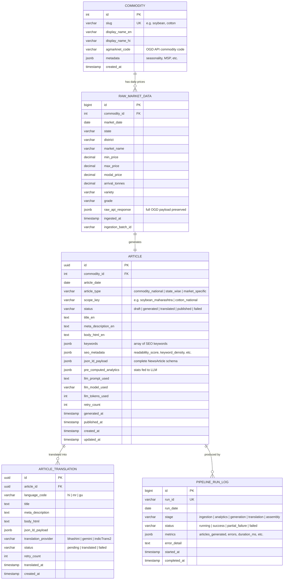
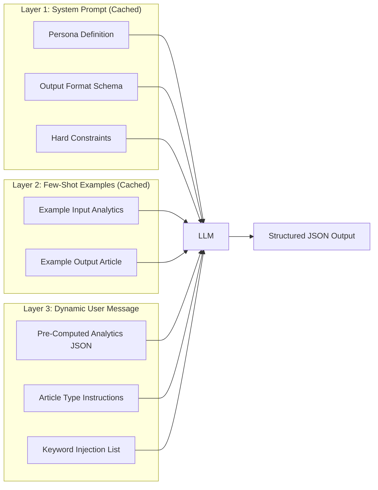
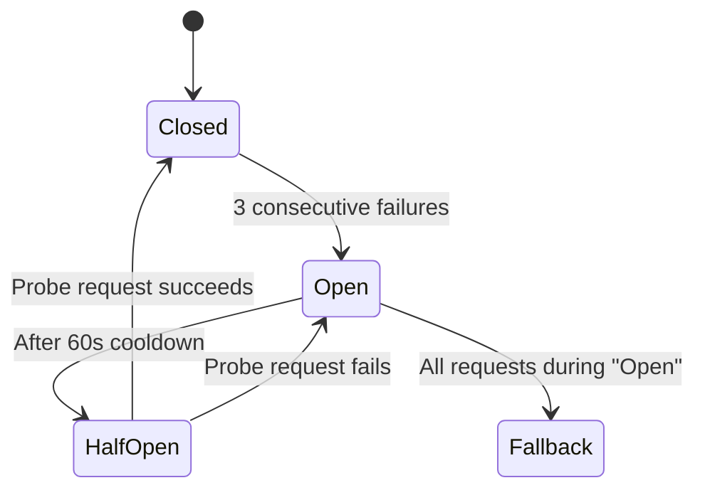

# MandiBhav by GramIQ — Phase 1: System Architecture Blueprint

> **Scope**: Design-only. No implementation code until explicit sign-off.
> **Daily target**: 15–20 SEO-optimized articles across Soybean & Cotton, in 4 languages (EN, HI, MR, GU), published to structured JSON output.

---

## 1. Tech Stack Selection

| Layer | Technology | Rationale |
|---|---|---|
| **Language** | Python 3.11+ | Mature async ecosystem, rich NLP/data libraries |
| **API Framework** | FastAPI | Async-native, auto-generated OpenAPI docs, Pydantic-first validation |
| **Database** | PostgreSQL 16 + SQLAlchemy 2.0 (async) | ACID compliance for article versioning & state machines; JSONB for flexible metadata |
| **Task Scheduler** | APScheduler (AsyncIOScheduler) | Lightweight, in-process cron; no Redis/broker dependency for a PoC-to-production path |
| **LLM Provider** | Google Gemini API (gemini-2.5-flash) | Free tier available, strong multilingual capability, structured JSON output mode |
| **Translation** | Bhashini API (primary) + Gemini native (fallback) | Government NMT for HI/MR/GU with superior Indic accuracy; LLM fallback if Bhashini is down |
| **Data Ingestion** | `httpx` (async) + data.gov.in OGD REST API | No browser dependencies, millisecond response, structured JSON payloads |
| **Validation** | Pydantic v2 | Schema-enforced structured output from LLM; type-safe config and DB models |
| **Templating** | Jinja2 | JSON-LD and HTML article template rendering |
| **Logging** | `structlog` | Structured JSON logging for observability |
| **HTTP Retry** | `tenacity` | Exponential backoff, configurable retry policies |

### Why NOT These Alternatives

| Rejected | Reason |
|---|---|
| Celery + Redis | Overkill for 15-20 daily articles; APScheduler keeps the stack lean without a message broker |
| MongoDB | Article versioning and state transitions benefit from relational integrity; PostgreSQL's JSONB gives NoSQL flexibility where needed |
| Selenium scraping | Brittle against Agmarknet's ASPX dynamic rendering; OGD API is the production-grade path |
| IndicTrans2 local | Requires GPU and ~8GB model weights; Bhashini API gives the same quality at zero infra cost |

---

## 2. Database Schema Design (PostgreSQL)

### 2.1 Entity Relationship Diagram



### 2.2 Key Design Decisions

| Decision | Rationale |
|---|---|
| **`raw_api_response` as JSONB** | Preserves the exact OGD payload for audit, replay, and debugging without schema migration |
| **`article_type` enum** | Enables distinct generation strategies: national roundup vs. state-level vs. single-market deep dive |
| **`scope_key` composite** | Natural deduplication key — prevents re-generating `soybean_maharashtra` twice on the same date |
| **`pre_computed_analytics` on Article** | The exact statistical facts fed to the LLM are stored alongside the article for traceability and prompt debugging |
| **`status` as state machine** | Explicit lifecycle: `draft → generated → translated → published`, with `failed` as a terminal state that can be retried |
| **Separate `ARTICLE_TRANSLATION` table** | Translations are independent operations that can fail/retry independently of the master English article |
| **`PIPELINE_RUN_LOG` per-stage** | Granular observability — if translation fails but generation succeeded, the log reflects exactly where |

### 2.3 Indexes

```sql
-- High-frequency query paths
CREATE UNIQUE INDEX idx_raw_market_unique
    ON raw_market_data (commodity_id, market_date, state, market_name, variety);

CREATE UNIQUE INDEX idx_article_scope_date
    ON article (scope_key, article_date);

CREATE INDEX idx_article_status ON article (status);
CREATE INDEX idx_article_date ON article (article_date DESC);

CREATE INDEX idx_translation_status
    ON article_translation (article_id, language_code, status);

CREATE INDEX idx_pipeline_run_date
    ON pipeline_run_log (run_date DESC, stage);
```

---

## 3. End-to-End Data Flow Architecture

```mermaid
flowchart TD
    subgraph "STAGE 1: Ingestion"
        A1[APScheduler Trigger<br/>06:00 IST Daily] --> A2[OGD REST API<br/>data.gov.in]
        A2 --> A3{Response OK?}
        A3 -- Yes --> A4[Parse & Validate<br/>Pydantic Models]
        A3 -- No --> A5[Retry with Backoff<br/>max 3 attempts]
        A5 --> A3
        A5 -- Exhausted --> A6[Load from<br/>Cached Yesterday Data]
        A4 --> A7[(PostgreSQL<br/>raw_market_data)]
        A6 --> A7
    end

    subgraph "STAGE 2: Analytics Pre-Computation"
        A7 --> B1[Query today's data<br/>by commodity]
        B1 --> B2[Compute Statistical<br/>Scaffolding via Pandas]
        B2 --> B3[Price Deltas vs Yesterday<br/>Top/Bottom Markets<br/>Arrival Volume Trends<br/>State Aggregations]
        B3 --> B4[Generate Article<br/>Scope Matrix]
        B4 --> B5["e.g. soybean_national,<br/>soybean_MP, soybean_MH,<br/>cotton_national, cotton_GJ..."]
    end

    subgraph "STAGE 3: LLM Article Generation"
        B5 --> C1[For each scope_key<br/>in matrix]
        C1 --> C2[Assemble Prompt<br/>System + Few-Shot + Data]
        C2 --> C3[Gemini API Call<br/>JSON mode]
        C3 --> C4{Valid Structured<br/>Output?}
        C4 -- Yes --> C5[Pydantic Validation<br/>ArticleOutput model]
        C4 -- No --> C6[Retry with<br/>adjusted prompt]
        C6 --> C3
        C5 --> C7[(PostgreSQL<br/>article table<br/>status=generated)]
    end

    subgraph "STAGE 4: Translation"
        C7 --> D1[For each article<br/>× 3 languages]
        D1 --> D2[Bhashini API<br/>EN→HI, EN→MR, EN→GU]
        D2 --> D3{Translation OK?}
        D3 -- Yes --> D4[(PostgreSQL<br/>article_translation)]
        D3 -- No --> D5[Fallback: Gemini<br/>native translation]
        D5 --> D4
        D4 --> D6[Update article<br/>status=translated]
    end

    subgraph "STAGE 5: SEO Assembly"
        D6 --> E1[Render JSON-LD<br/>NewsArticle Schema]
        E1 --> E2[Inject Organization<br/>& Person Nodes]
        E2 --> E3[Compute SEO Metrics<br/>keyword density,<br/>readability score]
        E3 --> E4[Assemble Final<br/>JSON Output Object]
    end

    subgraph "STAGE 6: Output & Publishing"
        E4 --> F1[Write to Output<br/>Directory as JSON files]
        F1 --> F2[Optional: POST to<br/>CMS Webhook]
        F2 --> F3[Update article<br/>status=published]
        F3 --> F4[Log Pipeline Run<br/>Metrics to DB]
    end
```



### 3.1 Stage-by-Stage Trace

#### Stage 1 — Data Ingestion (06:00 IST)
1. APScheduler fires the `ingest_daily_prices` job
2. `httpx.AsyncClient` sends GET requests to OGD API for each commodity (`soybean`, `cotton`)
3. API key is read from environment; request includes `api-key`, `format=json`, `filters[commodity]`, `filters[arrival_date]`
4. Response is validated against `RawMarketRecord` Pydantic model (enforces numeric types, non-null market names)
5. Valid records are bulk-inserted into `raw_market_data` via async SQLAlchemy
6. Duplicate records (same commodity + date + market + variety) are skipped via `ON CONFLICT DO NOTHING`
7. If API returns HTTP 5xx or timeout: retry 3× with exponential backoff (2s, 4s, 8s)
8. If all retries fail: query yesterday's data from the DB and log a `partial_failure` in `pipeline_run_log`

#### Stage 2 — Analytics Pre-Computation
1. Query all `raw_market_data` for today's date, grouped by commodity
2. For each commodity, compute via Pandas:
   - **National average** modal price
   - **Day-over-day delta** (vs. yesterday's national average)
   - **Top 5 markets** by highest modal price
   - **Bottom 5 markets** by lowest modal price
   - **Total arrivals** (tonnes) and % change vs. yesterday
   - **State-level aggregations** (avg price, total arrivals per state)
3. Build the **scope matrix** — a list of `(article_type, scope_key)` tuples:
   - `(commodity_national, soybean_national)` — 1 article
   - `(state_wise, soybean_{state})` — N articles (one per active state)
   - `(commodity_national, cotton_national)` — 1 article
   - `(state_wise, cotton_{state})` — N articles
   - Optionally: `(market_specific, soybean_{market})` for high-volume markets
4. Each tuple gets its own pre-computed analytics JSON blob stored in the eventual article row

#### Stage 3 — LLM Article Generation
1. For each `(article_type, scope_key)` in the scope matrix:
2. Load the appropriate **prompt template** (see §4 for full strategy)
3. Inject the pre-computed analytics as a structured data block into the user message
4. Call `google.generativeai` with `response_mime_type="application/json"` and a Pydantic-derived `response_schema`
5. Validate the response against `ArticleOutput` Pydantic model:
   ```
   ArticleOutput:
     title: str (max 70 chars)
     meta_description: str (max 160 chars)
     body_html: str (valid HTML)
     keywords: list[str] (5-10 items)
     market_summary_table: list[MarketRow]
   ```
6. If validation fails → retry with an error-correction prompt (max 2 retries)
7. Store the article in `article` table with `status=generated`

#### Stage 4 — Multilingual Translation
1. For each generated article, spawn 3 parallel translation tasks (HI, MR, GU)
2. **Primary path**: Call Bhashini API with the English `body_html` (stripped of HTML tags → translated → re-wrapped)
3. **Fallback path**: If Bhashini returns error or timeout, use Gemini with a translation-specific prompt
4. Title and meta_description are translated separately (short-text translation for precision)
5. Store in `article_translation` with the provider used
6. When all 3 translations complete, update article `status=translated`

#### Stage 5 — SEO/GEO Assembly
1. For the English article + each translation:
2. Render JSON-LD using Jinja2 template:
   ```json
   {
     "@context": "https://schema.org",
     "@graph": [
       { "@type": "Organization", "@id": "https://gramiq.com/#organization", ... },
       { "@type": "NewsArticle", "@id": "...", "headline": "...", "publisher": {"@id": "..."}, ... }
     ]
   }
   ```
3. Compute SEO analytics: keyword density, Flesch readability score, heading structure validation
4. Store `json_ld_payload` and `seo_metadata` on the article/translation row

#### Stage 6 — Output & Publishing
1. Assemble the final JSON output per the assignment spec:
   ```json
   {
     "title": "...",
     "meta_description": "...",
     "body": "...",
     "keywords": [...],
     "language": "en",
     "date": "2026-06-04",
     "json_ld": { ... }
   }
   ```
2. Write to `output/{date}/{scope_key}/{language}.json`
3. Optionally POST to a CMS webhook endpoint (configurable)
4. Update article `status=published`
5. Write summary metrics to `pipeline_run_log`

---

## 4. LLM Prompting & Formatting Strategy

### 4.1 The Core Problem

Raw tabular data fed directly to an LLM causes hallucination — the model invents price trends, miscalculates percentages, and confuses min/max/modal prices. The DataTales benchmark (arXiv:2410.17859) proves that LLMs fail at complex data narration without pre-computed analytical scaffolding.

### 4.2 Solution: Three-Layer Prompt Architecture



#### Layer 1: System Prompt (Constant, cached across all calls)

```
You are "MandiBhav Lekhak" — a veteran agricultural journalist who has covered
Indian commodity markets for 20 years. You write with warmth, authority, and
deep empathy for the farming community. Your readers are farmers, traders, and
agricultural professionals who need actionable market intelligence.

ABSOLUTE RULES:
1. NEVER invent statistics. Use ONLY the numbers provided in the data block.
2. NEVER reference external markets, global prices, or news not in the data.
3. Always attribute price movements to the specific market/state data given.
4. Include EXACTLY the SEO keywords provided — weave them naturally into headings and prose.
5. Output must be valid JSON matching the provided schema EXACTLY.
6. The article body must be HTML with semantic tags (h2, h3, p, table, strong).
7. Write in a narrative story format. NO bullet-point lists as the primary structure.
8. Every article must have: an engaging hook → regional breakdown → actionable outlook.
```

#### Layer 2: Few-Shot Examples (1 example per article type, cached)

For `commodity_national` type:
```json
{
  "input_analytics": {
    "commodity": "Soybean",
    "date": "2026-06-03",
    "national_avg_modal": 4850,
    "prev_day_avg_modal": 4790,
    "day_change_pct": 1.25,
    "top_markets": [
      {"market": "Mandsaur", "state": "MP", "modal_price": 5200},
      {"market": "Latur", "state": "MH", "modal_price": 5100}
    ],
    "bottom_markets": [
      {"market": "Kota", "state": "RJ", "modal_price": 4400}
    ],
    "total_arrivals_tonnes": 12500,
    "arrival_change_pct": -8.3
  },
  "output_article": {
    "title": "Soybean Mandi Bhav Today: Prices Rally 1.25% as Arrivals Dip Across India",
    "meta_description": "Today's soybean mandi bhav shows a 1.25% price increase...",
    "body_html": "<h2>Soybean Market Overview — 3 June 2026</h2><p>The soybean market...</p>...",
    "keywords": ["soybean mandi bhav today", "soybean price today", "soyabean bhav"]
  }
}
```

#### Layer 3: Dynamic User Message (Unique per article)

```
Generate a {article_type} article for {commodity} on {date}.

PRE-COMPUTED MARKET ANALYTICS (use ONLY these numbers):
{pre_computed_analytics_json}

MANDATORY SEO KEYWORDS (include all naturally):
{keyword_list}

ARTICLE TYPE INSTRUCTIONS:
- For "commodity_national": Cover the full national picture. Compare top vs bottom markets.
  Discuss arrival trends. End with an outlook for farmers.
- For "state_wise": Deep-dive into {state}'s markets. Compare districts.
  Reference the national average for context.
```

### 4.3 SEO Keyword Strategy

Keywords are generated deterministically (not by the LLM) based on commodity + scope:

| Scope | Keywords Generated |
|---|---|
| `soybean_national` | `soybean mandi bhav today`, `soybean price today`, `soyabean bhav`, `soybean rate India {date}` |
| `soybean_maharashtra` | `soybean mandi bhav Maharashtra`, `soybean bhav MH today`, `soyabean rate Maharashtra` |
| `cotton_national` | `cotton mandi bhav today`, `kapas bhav today`, `cotton price India {date}`, `kapas rate` |
| `cotton_gujarat` | `kapas bhav Gujarat today`, `cotton rate Gujarat`, `cotton mandi bhav GJ` |

These are passed to the LLM as a constraint, not generated by it, ensuring consistent SEO targeting.

### 4.4 Structured Output Enforcement

Gemini's `response_mime_type="application/json"` + `response_schema` parameter is used to enforce the output shape at the API level. The Pydantic model serves as double-validation:

```python
class MarketRow(BaseModel):
    market_name: str
    state: str
    min_price: float
    max_price: float
    modal_price: float

class ArticleOutput(BaseModel):
    title: str = Field(max_length=70)
    meta_description: str = Field(max_length=160)
    body_html: str
    keywords: list[str] = Field(min_length=3, max_length=10)
    market_summary_table: list[MarketRow]
```

### 4.5 JSON-LD Entity Graph Template

The system generates this for every article (rendered via Jinja2):

```json
{
  "@context": "https://schema.org",
  "@graph": [
    {
      "@type": "Organization",
      "@id": "https://gramiq.com/#organization",
      "name": "GramIQ",
      "url": "https://gramiq.com",
      "logo": {
        "@type": "ImageObject",
        "url": "https://gramiq.com/logo.png"
      },
      "sameAs": []
    },
    {
      "@type": "NewsArticle",
      "@id": "https://gramiq.com/mandi-bhav/{{scope_key}}/{{date}}#article",
      "headline": "{{title}}",
      "description": "{{meta_description}}",
      "datePublished": "{{date_iso}}",
      "dateModified": "{{date_iso}}",
      "author": {
        "@type": "Organization",
        "@id": "https://gramiq.com/#organization"
      },
      "publisher": {
        "@type": "Organization",
        "@id": "https://gramiq.com/#organization"
      },
      "inLanguage": "{{language_code}}",
      "keywords": "{{keywords_csv}}",
      "dateline": "{{dateline_location}}, India",
      "articleBody": "{{plain_text_body}}",
      "mainEntityOfPage": {
        "@type": "WebPage",
        "@id": "https://gramiq.com/mandi-bhav/{{scope_key}}/{{date}}"
      }
    }
  ]
}
```

> [!IMPORTANT]
> The `@id` architecture ensures every article links back to the canonical Organization node, building GramIQ's entity graph across all articles. This is the "comprehension subsidy" that GEO research identifies as critical for AI engine discoverability.

---

## 5. Error Handling, Retries, and Circuit Breakers

### 5.1 Error Classification

| Error Class | Examples | Strategy |
|---|---|---|
| **Transient** | API timeout, HTTP 502/503, rate limit (429) | Retry with exponential backoff |
| **Data Quality** | Missing fields, zero prices, duplicate markets | Log warning, skip record, continue pipeline |
| **LLM Failure** | Malformed JSON output, schema violation | Retry with corrective prompt (max 2×) |
| **Translation Failure** | Bhashini API down, invalid response | Fallback to Gemini native translation |
| **Fatal** | Invalid API key, DB connection lost, disk full | Abort pipeline run, alert via log |

### 5.2 Retry Policy (via `tenacity`)

```python
# All external API calls use this decorator pattern
@retry(
    stop=stop_after_attempt(3),
    wait=wait_exponential(multiplier=2, min=2, max=30),
    retry=retry_if_exception_type((httpx.TimeoutException, httpx.HTTPStatusError)),
    before_sleep=log_retry_attempt,
    reraise=True,
)
async def call_ogd_api(...):
    ...
```

### 5.3 Circuit Breaker Pattern

For the Agmarknet/OGD API and Bhashini API, we implement a lightweight circuit breaker:



| Service | Fallback When Circuit Open |
|---|---|
| **OGD API** | Query yesterday's cached `raw_market_data` from PostgreSQL. Article is marked with `data_freshness: "previous_day"` |
| **Bhashini** | Route translation through Gemini API with translation-specific prompt |
| **Gemini** | Mark article as `failed`, retry in next pipeline run. Log for manual review |

### 5.4 Pipeline-Level Resilience

- **Partial Success**: If 12 of 15 articles generate successfully, the pipeline publishes the 12 and logs the 3 failures. It does NOT roll back successful work.
- **Idempotency**: The `UNIQUE(scope_key, article_date)` constraint on the `article` table prevents double-generation. Re-running the pipeline for the same day is safe.
- **Stale Data Detection**: If ingestion gets yesterday's data (fallback), the generated article title and metadata explicitly include "(Based on {actual_date} data)" to maintain journalistic integrity.
- **Rate Limit Awareness**: Gemini Free API has limits (~15 RPM for flash). The generation loop uses `asyncio.Semaphore(5)` and inter-request delays to stay well within limits.

### 5.5 Observability

Every pipeline run writes structured logs:

```json
{
  "run_id": "run_20260604_0600",
  "stage": "generation",
  "scope_key": "soybean_national",
  "status": "success",
  "duration_ms": 3420,
  "llm_tokens": 1850,
  "retries": 0,
  "timestamp": "2026-06-04T06:12:33+05:30"
}
```

The `PIPELINE_RUN_LOG` table aggregates these for historical analysis. The optional `/health` FastAPI endpoint reports:
- Last successful pipeline run timestamp
- Count of articles published today
- Current circuit breaker states
- Database connection pool stats

---

## 6. Proposed File Structure (Phase 2)

```
gramiq-mandibhav/
├── config.py              # Env vars, API keys, prompt templates, constants
├── database.py            # SQLAlchemy models, async engine, session factory
├── ingestion.py           # OGD API client, data validation, bulk insert
├── analytics.py           # Pandas-based statistical pre-computation
├── llm_engine.py          # Gemini client, prompt assembly, output validation
├── translator.py          # Bhashini + Gemini translation, fallback logic
├── seo_assembler.py       # JSON-LD generation, SEO metrics, final output
├── scheduler.py           # APScheduler jobs, pipeline orchestration
├── main.py                # FastAPI app, health endpoint, manual triggers
├── circuit_breaker.py     # Lightweight circuit breaker implementation
├── models/
│   ├── __init__.py
│   ├── schemas.py         # Pydantic models (API input/output, LLM schemas)
│   └── db_models.py       # SQLAlchemy ORM models (moved from database.py if needed)
├── templates/
│   ├── prompts/
│   │   ├── system_prompt.txt
│   │   ├── few_shot_national.json
│   │   ├── few_shot_state.json
│   │   └── translation_prompt.txt
│   └── seo/
│       └── jsonld_template.json.j2
├── output/                # Generated article JSONs (by date/scope/language)
├── tests/
│   ├── test_ingestion.py
│   ├── test_analytics.py
│   ├── test_llm_engine.py
│   └── test_seo.py
├── alembic/               # Database migrations
│   └── versions/
├── alembic.ini
├── requirements.txt
├── .env.example
└── README.md
```

### Module Responsibility Matrix

| Module | Depends On | Responsibility |
|---|---|---|
| `config.py` | (none) | Load `.env`, define constants, prompt template paths |
| `database.py` | `config` | Async engine, session factory, ORM models |
| `ingestion.py` | `config`, `database`, `circuit_breaker` | Fetch OGD API → validate → store `raw_market_data` |
| `analytics.py` | `database` | Query raw data → compute stats → return scope matrix |
| `llm_engine.py` | `config`, `models.schemas` | Assemble prompts → call Gemini → validate output |
| `translator.py` | `config`, `circuit_breaker` | Bhashini/Gemini translation → store translations |
| `seo_assembler.py` | `config`, `templates` | Render JSON-LD → compute SEO metrics → assemble output JSON |
| `scheduler.py` | all above | Orchestrate the 6-stage pipeline as a daily cron |
| `main.py` | `scheduler`, `database` | FastAPI app with `/health`, `/trigger`, `/articles/{date}` |
| `circuit_breaker.py` | (none) | Generic async circuit breaker class |

---

## 7. Open Questions for Your Review

> [!IMPORTANT]
> ### Q1: OGD API Key Availability
> Do you already have a data.gov.in API key? The OGD API is the recommended production path. If not, we can implement the Agmarknet direct scraping (via `httpx` + parameter injection, no Selenium) as the primary ingestion path, with the OGD API added later.

> [!IMPORTANT]
> ### Q2: Gemini API Key & Tier
> Which Gemini API tier are you using? The free tier has rate limits (~15 RPM for Flash). This impacts whether we generate articles sequentially or can parallelize. If you have a paid tier, we can be more aggressive with concurrency.

> [!WARNING]
> ### Q3: Bhashini API Access
> Bhashini requires registration at bhashini.gov.in. Do you have API credentials? If not, we can start with Gemini-native multilingual generation for all languages and add Bhashini later as an upgrade path.

> [!IMPORTANT]
> ### Q4: Output Destination
> The assignment spec says "structured JSON object" as output. Should we:
> - **(A)** Write JSON files to a local `output/` directory (simplest, meets spec)
> - **(B)** Also serve them via FastAPI endpoints (e.g., `GET /articles/{date}/{scope}`)
> - **(C)** Push to an external CMS via webhook
> For the PoC, I recommend **(A)** with **(B)** as a bonus. Let me know your preference.

> [!NOTE]
> ### Q5: Dashboard (Bonus)
> The assignment lists a preview dashboard as bonus points. Should I include a minimal FastAPI + Jinja2 HTML dashboard for article preview in Phase 2, or defer it?

---

## Verification Plan

### Automated Tests
- `pytest` with `pytest-asyncio` for all async code
- Mock OGD API responses for ingestion tests
- Mock Gemini API for LLM engine tests (validate prompt assembly + output parsing)
- Integration test: feed real sample data through analytics → verify computed stats match manual calculations
- JSON-LD output validated against Schema.org validator

### Manual Verification
- Run the full pipeline against live OGD API for one day's data
- Visually inspect 3-5 generated articles for narrative quality, factual accuracy, and SEO keyword presence
- Validate JSON-LD using Google's Rich Results Test tool
- Check translations against native speakers (at least a spot check for Hindi)

---

> **STOP HERE.** Awaiting your review, architectural modifications, and explicit sign-off before proceeding to Phase 2 implementation.
