# MandiBhav by GramIQ

## Architecture Evolution

This section documents the architectural evolution of the MandiBhav by GramIQ project, showing how the system evolved from an AI-centric prototype into a data-grounded agricultural intelligence platform.

---

# Version 1 — Naive Architecture (AI-Centric)

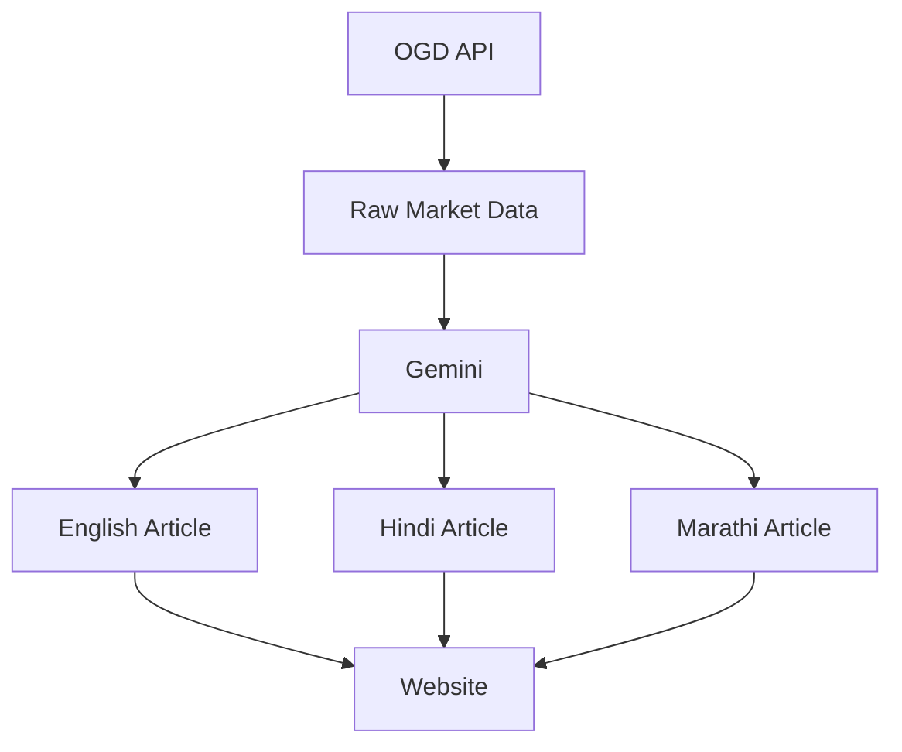

## Characteristics

- AI directly consumes raw data
- No analytics layer
- No validation layer
- No truthfulness checks
- No fallback mechanism
- Multiple language generation

## Problems

- Hallucinations
- Translation drift
- High API usage
- No explainability
- AI became the source of truth

## Key Lesson

> AI should not be the source of truth.

---

# Version 2 — Overengineered Architecture

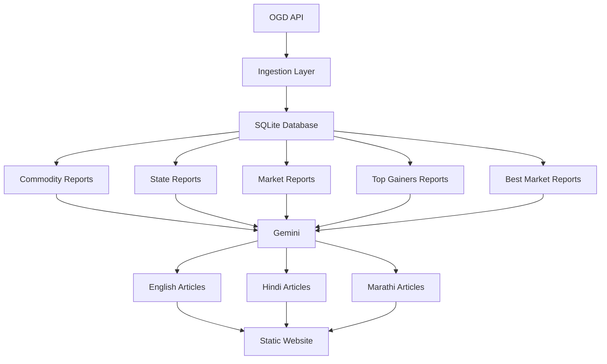

## Characteristics

- Multiple report types
- Multiple commodities
- Multiple languages
- Heavy AI usage
- SEO-first content generation

## Problems

- 20+ articles per run
- Excessive Gemini API calls
- Long execution times
- Difficult debugging
- Translation inconsistencies
- Scope creep
- Rising infrastructure complexity

## Key Lesson

> A working pipeline is worth more than twenty partially working pipelines.

---

# Version 3 — Analytics-Driven Architecture

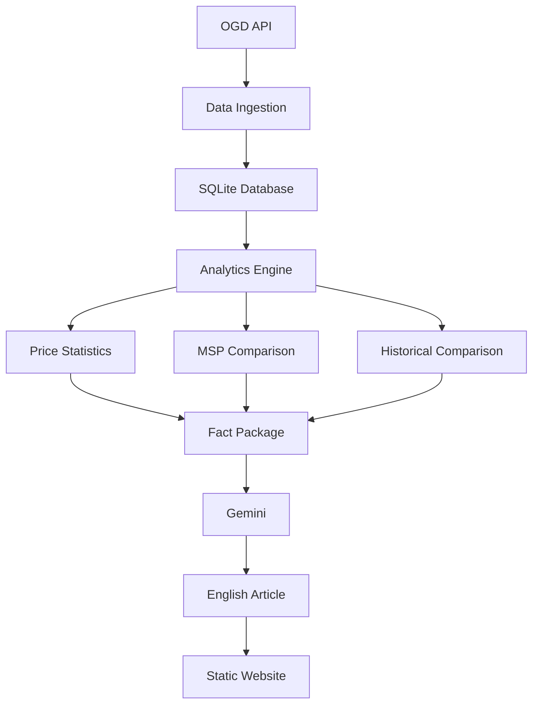

## Improvements

- Analytics layer introduced
- Structured fact generation
- Reduced article generation
- Reduced API costs
- Faster execution
- Improved maintainability

## Remaining Problems

- Unsupported claims
- Hallucinated commentary
- Overconfident reports
- No claim validation

## Key Lesson

> Analytics should transform data into facts before AI sees it.

---

# Version 4 — Truthfulness Architecture

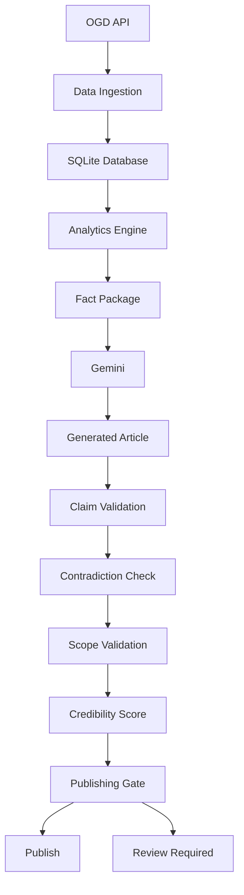

## Improvements

- Truthfulness layer added
- Contradiction detection
- Scope locking
- Credibility scoring
- Publishing gate
- Better transparency

## Remaining Problems

- Translation inconsistencies
- Weak multilingual validation
- Quality reports focused too much on formatting

## Key Lesson

> SEO correctness is not factual correctness.

---

# Version 5 — Final Architecture (Current)

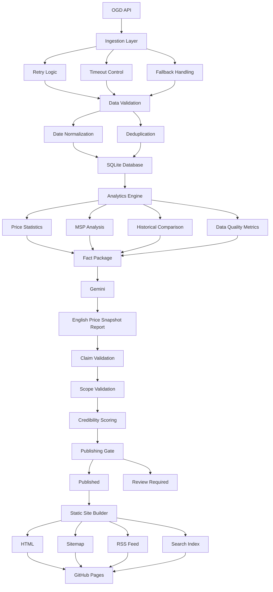

## Major Improvements

### Reliability

- Retry logic
- Timeout controls
- Fallback handling
- Historical cache support

### Data Quality

- Date normalization
- Deduplication
- Validation layer

### Analytics

- MSP comparison
- Historical comparison
- Price statistics
- Data quality metrics

### Content

- Single source of truth
- English-only article generation
- Data-grounded reporting

### Trust Layer

- Claim validation
- Scope validation
- Credibility scoring
- Publishing gate

### Publishing

- HTML generation
- Sitemap
- RSS feed
- Search index
- GitHub Pages deployment

## Key Lesson

> AI should transform facts into language, not transform guesses into facts.

---

# Detailed Component Architecture

## Data Layer

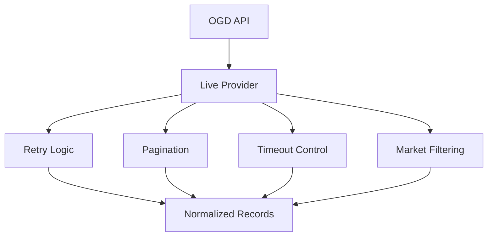

### Responsibilities

- API communication
- Pagination
- Retry handling
- Timeout management
- Data filtering
- Data normalization

---

## Analytics Layer

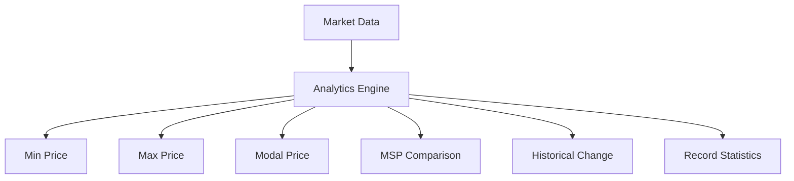

### Responsibilities

- Convert raw market records into structured facts
- Generate metrics for report generation

---

## Content Layer

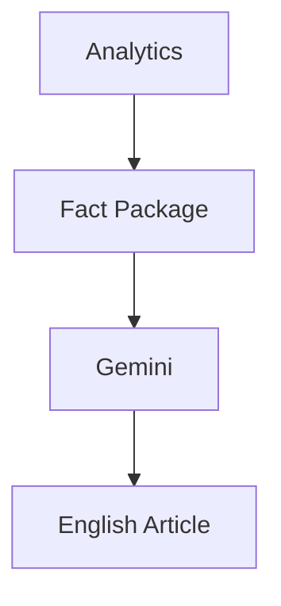

### Responsibilities

- Convert facts into human-readable content
- Preserve factual integrity

---

## Trust Layer

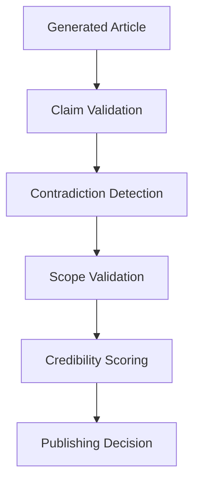

### Responsibilities

- Prevent hallucinations
- Validate claims
- Ensure scope consistency
- Calculate trustworthiness

---

## Publishing Layer

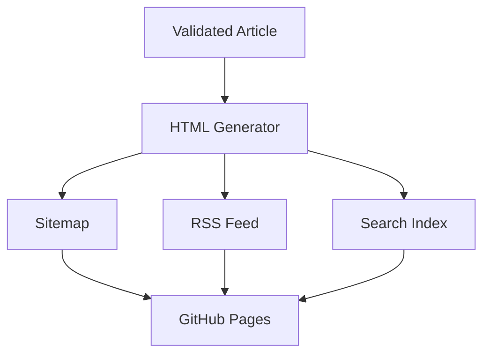

### Responsibilities

- Website generation
- Search indexing
- SEO support
- Deployment

---

# Architecture Evolution Summary

---

# Philosophy Evolution

## Version 1

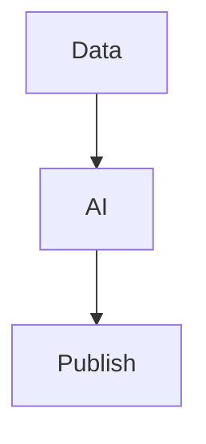

### Philosophy

> Data → AI → Publish

---

## Final Version

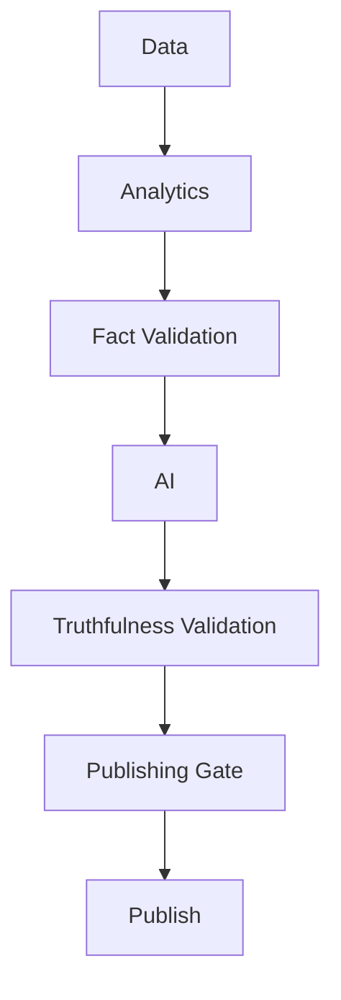

### Philosophy

> Data → Analytics → Validation → AI → Validation → Publish

---

# Final Design Principle

> The data is the source of truth.

> Analytics extracts facts from the data.

> AI transforms facts into human-readable reports.

> Validation ensures that AI never exceeds the evidence provided by the data.

This became the most important architectural decision in the entire project and represents the evolution from an AI-generated content system into a trustworthy agricultural intelligence platform.
